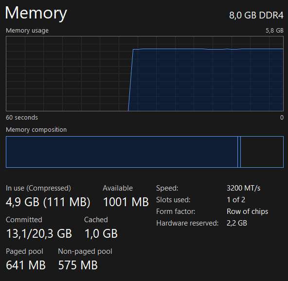
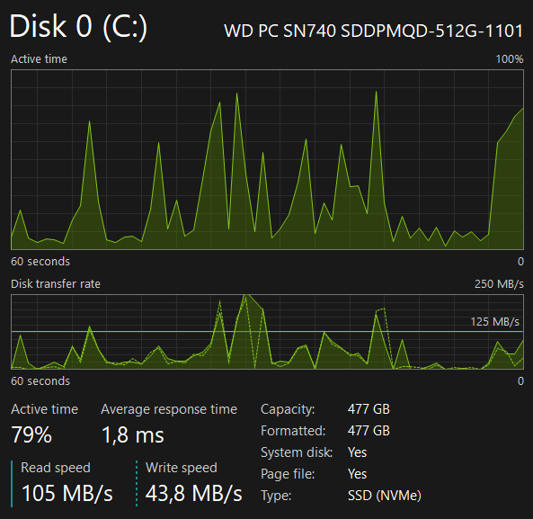
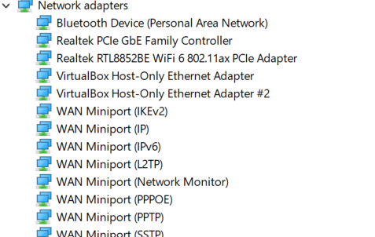
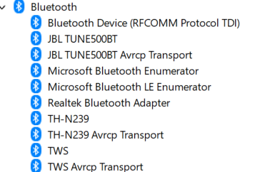
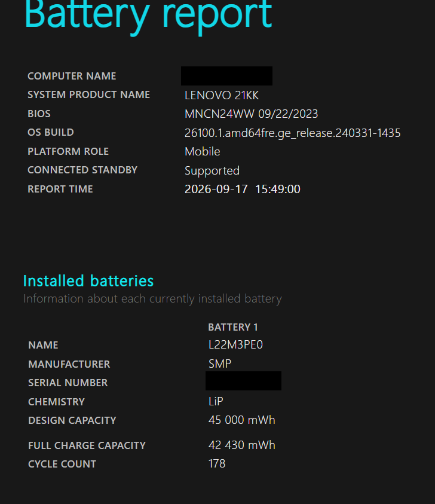
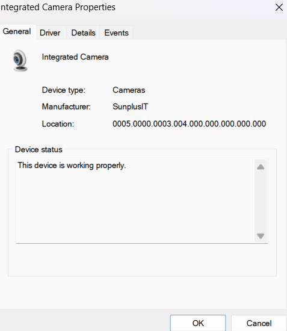
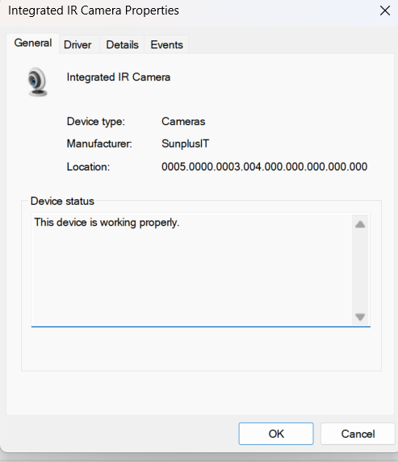
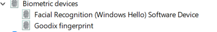
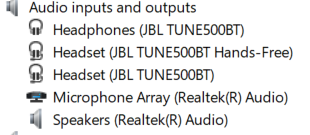

# CompTIA A+ Core 1 Lab — Laptop Hardware Identification & Upgrade Assessment

## Objective

**CompTIA A+ 220-1201 — Objective 1.1: Laptop Hardware**

This lab applies the laptop-hardware concepts covered while studying Professor Messer's CompTIA A+ 220-1201 Objective 1.1 material.

The aim was not just to identify components, but to use Windows tools to inspect a real laptop, determine what hardware is present, assess upgrade/service considerations, and perform a basic troubleshooting isolation exercise.

---

## Lab System

| Item | Finding |
|---|---|
| Manufacturer | Lenovo |
| Machine type / model | 21KK |
| Platform | AMD laptop |
| Operating system | Windows |
| Installed RAM | 8 GB DDR4-3200 |
| Storage | WD PC SN740 512 GB NVMe SSD |
| Wi-Fi | Realtek RTL8852BE Wi-Fi 6 / 802.11ax |
| Wired NIC | Realtek PCIe GbE Family Controller |
| Bluetooth | Realtek Bluetooth Adapter |
| Battery | L22M3PE0, 45 Wh design capacity |
| Webcam | Integrated Camera |
| IR camera | Integrated IR Camera |
| Fingerprint reader | Goodix fingerprint |
| Microphone | Realtek Microphone Array |

> Sensitive values that were not relevant to demonstrating the technical work were redacted from public evidence.

---

## 1. System Identification

Windows **System Information (`msinfo32`)** was used to identify the machine.

Observed:

- **System Manufacturer:** Lenovo
- **System Model / Machine Type:** 21KK


### Why this matters

Laptop service procedures and compatible replacement parts can vary significantly between manufacturers and models. Correct model identification should therefore happen before ordering parts or disassembling a laptop.

---

## 2. Memory Inspection

Windows Task Manager showed:

- **8.0 GB DDR4**
- **3200 MT/s**
- **1 of 2 slots used**



PowerShell was also used to inspect the physical memory module:

```powershell
Get-CimInstance Win32_PhysicalMemory |
Select-Object DeviceLocator,Manufacturer,PartNumber,Capacity,Speed,FormFactor
```

Observed result:

```text
DeviceLocator : DIMM 0
Manufacturer  : Hynix
PartNumber    : HMAA1GS6CJR6N-XN
Capacity      : 8589934592
Speed         : 3200
FormFactor    : 0
```

### Assessment

The laptop has one **8 GB DDR4-3200 memory module** installed and Windows reports one of two memory slots in use.

The A+ lesson introduced **SO-DIMM** as the smaller memory-module form factor commonly used by laptops. It also highlighted the serviceability difference between removable modules and memory soldered directly to a system board.

### Upgrade note

The system currently has only 8 GB installed, so memory expansion is a practical future upgrade for this machine. No hardware was changed during this lab.

---

## 3. Storage Inspection

Task Manager was used to inspect the primary storage device.

Observed:

- **Model:** WD PC SN740 SDDPMQD-512G-1101
- **Nominal capacity:** 512 GB
- **Windows displayed capacity:** approximately 477 GB
- **Type:** SSD (NVMe)



### Concepts reinforced

It is important not to treat these terms as interchangeable:

- **HDD vs SSD** describes storage technology.
- **2.5-inch vs M.2** describes physical form factor.
- **SATA vs NVMe** describes different storage interfaces/protocol families.

The A+ material also covered **imaging/cloning** as a way to migrate an existing operating system, applications, and user files from an older drive to a replacement SSD instead of reinstalling everything manually.

---

## 4. Network Hardware

Device Manager showed the physical and virtual network interfaces installed on the system.



### Physical interfaces

**Wireless adapter**

```text
Realtek RTL8852BE WiFi 6 802.11ax PCIe Adapter
```

This identifies:

- Wi-Fi 6 capability
- IEEE 802.11ax
- PCIe-connected wireless hardware

**Wired network adapter**

```text
Realtek PCIe GbE Family Controller
```

This provides wired Gigabit Ethernet connectivity.

### Virtual interfaces

The system also contains:

```text
VirtualBox Host-Only Ethernet Adapter
VirtualBox Host-Only Ethernet Adapter #2
```

These are software-created virtual adapters used by VirtualBox rather than separate physical NICs.

This was useful practice in distinguishing **physical hardware** from **software-created interfaces**.

---

## 5. Bluetooth

Device Manager showed a **Realtek Bluetooth Adapter** as the laptop's Bluetooth hardware.



Windows also displayed components such as:

- Microsoft Bluetooth Enumerator
- Microsoft Bluetooth LE Enumerator
- Bluetooth Device (RFCOMM Protocol TDI)

Several paired Bluetooth peripherals were visible as well.

### Concept reinforced

Bluetooth is commonly associated with a **PAN — Personal Area Network** and is designed for short-range connectivity between devices and peripherals.

The A+ lesson also discussed laptop wireless cards and the **main / auxiliary (aux)** antenna connections commonly associated with wireless adapters.

---

## 6. Battery Assessment

A Windows battery report was generated with:

```powershell
powercfg /batteryreport
```



Observed:

| Property | Result |
|---|---:|
| Battery model | L22M3PE0 |
| Manufacturer | SMP |
| Chemistry reported by Windows | LiP |
| Design capacity | 45,000 mWh |
| Full charge capacity | 42,430 mWh |
| Cycle count | 178 |

### Battery-health calculation

```text
42,430 / 45,000 × 100 ≈ 94.3%
```

The current full-charge capacity is therefore approximately **94.3% of the original design capacity**, representing approximately **5.7% capacity loss** compared with design capacity.

### Serviceability concept

The lesson contrasted:

- externally removable/modular laptop batteries; and
- internally installed batteries that require laptop disassembly for replacement.

This laptop uses the internal-serviceable style rather than a quick-release external battery.

---

## 7. Camera Hardware

Device Manager showed both a normal camera and an infrared camera.


### Integrated camera

Manufacturer reported by Windows:

```text
SunplusIT
```



The normal integrated camera is used for functions such as video conferencing and video capture.

### Integrated IR camera

Windows also detects:

```text
Integrated IR Camera
Manufacturer: SunplusIT
```



The infrared camera can support facial-recognition authentication.

---

## 8. Biometric Authentication

Device Manager showed:

- **Facial Recognition (Windows Hello) Software Device**
- **Goodix fingerprint**



### Concept reinforced

Biometric login requires both:

1. suitable **hardware**, such as an IR camera or fingerprint reader; and
2. **operating-system/software support**.

This machine provides hardware for both facial recognition and fingerprint authentication.

An unexpected finding from the inspection was discovering that the laptop had a fingerprint reader even though I had not previously realised the feature was present.

---

## 9. Audio Hardware

Device Manager showed:

- **Microphone Array (Realtek(R) Audio)**
- **Speakers (Realtek(R) Audio)**
- Bluetooth audio endpoints for paired devices



The integrated microphone array supports built-in voice capture without requiring an external microphone.

---

## 10. Keyboard Troubleshooting Exercise

### Scenario

The laptop's built-in keyboard stops accepting keystrokes, while Windows otherwise starts and operates normally.

### Isolation test

Connect a known-good external USB keyboard.

### Test result

The external keyboard works correctly.

### Assessment

The successful external-keyboard test makes a fault with the **built-in keyboard or its physical connection more likely**, while making a general operating-system keyboard problem less likely.

### Next actions

1. Inspect the built-in keyboard for physical damage.
2. Inspect the keyboard ribbon cable.
3. Inspect the system-board connector.
4. Reseat the connection if appropriate and permitted by the manufacturer's service procedure.
5. Retest.
6. Replace the keyboard if hardware failure is confirmed.

### Troubleshooting principle

The important part of the exercise was not simply choosing "replace the keyboard." The external keyboard was used as a **known-good device to isolate the fault domain** before replacing hardware.

---

## Key Study Notes from Objective 1.1

### Laptop serviceability

- Laptop hardware is densely packaged and often model-specific.
- Some systems provide easy access to RAM and storage.
- Other components may be soldered or require significant disassembly.
- Manufacturer service documentation should be followed before repair or replacement.

### Batteries

- Common laptop battery families covered in the lesson include lithium-ion and lithium-ion polymer.
- Modern lithium-based batteries do not have the traditional memory-effect behaviour associated with older battery technologies.
- Battery compatibility is model-specific.
- Modular batteries are easier to replace than internally installed batteries.

### Keyboards

- Laptop keyboards commonly connect to the system board using a ribbon cable.
- Individual laptop key mechanisms can be fragile.
- A known-good external USB keyboard can help isolate a built-in keyboard fault.

### Memory

- Laptop systems commonly use **SO-DIMM** memory.
- Some laptops use removable modules.
- Other laptops solder memory directly to the motherboard.

### Storage

- Older laptops commonly used 2.5-inch hard drives.
- SSDs have no moving parts and offer faster access than traditional spinning disks.
- Modern laptops commonly use compact M.2 storage.
- Imaging/cloning can migrate an existing system to a replacement drive.

### Wireless hardware

- Laptop Wi-Fi may be integrated or installed on a replaceable card.
- Wireless cards commonly connect to built-in antenna leads.
- **Main** and **auxiliary** are common antenna-connector labels.
- Bluetooth provides short-range connectivity and is associated with a **Personal Area Network (PAN)**.

### Biometrics

- Facial recognition requires suitable camera hardware plus operating-system support.
- Fingerprint authentication requires a fingerprint reader plus operating-system support.
- Windows Hello is an example of OS-level biometric authentication support.

### NFC

- **NFC = Near Field Communication**
- It is intended for very short-range communication.
- The lesson used payments and authentication as examples.

### Camera and microphone

- Laptops commonly integrate cameras and microphones for communication and conferencing.
- External devices can be used when higher quality or additional capability is required.

---

## Skills Demonstrated

- Windows System Information
- Windows Task Manager
- Windows Device Manager
- PowerShell / CIM hardware inspection
- Windows battery reporting
- Laptop component identification
- Memory-upgrade assessment
- SSD/NVMe identification
- Physical vs virtual NIC identification
- Bluetooth hardware identification
- Camera and biometric-device identification
- Battery-health assessment
- Hardware fault isolation
- Technical documentation
- Evidence collection for troubleshooting work

---

## Evidence Files

```text
screenshots/
├── 01-system-manufacturer-model.png
├── 02-memory-task-manager.png
├── 03-storage-nvme-ssd.png
├── 04-network-adapters.png
├── 05-bluetooth-devices.png
├── 06-battery-report-redacted.png
├── 07-camera-devices.png
├── 08-integrated-camera-properties.png
├── 09-ir-camera-properties.png
├── 10-biometric-devices.png
└── 11-audio-input-output.png
```

---

## Outcome

This lab turned the Objective 1.1 material into practical hardware-inspection and troubleshooting evidence rather than treating the lesson as video-only study.

The system was inspected using built-in Windows tools, hardware capabilities were identified, service/upgrade considerations were assessed, and a simple known-good-device troubleshooting method was applied.
